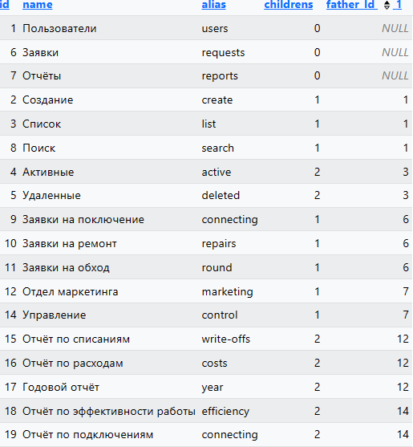
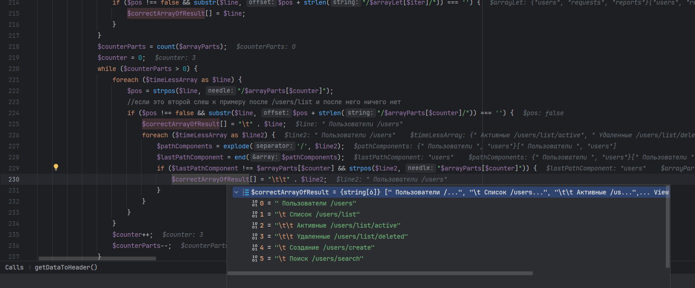
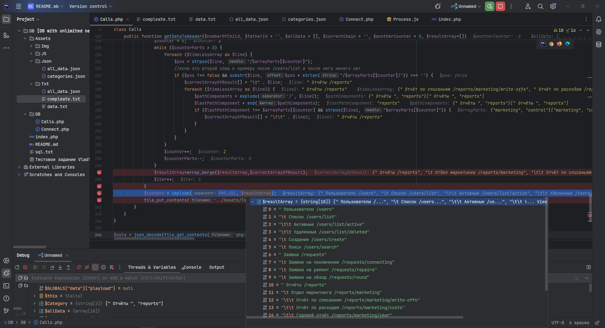
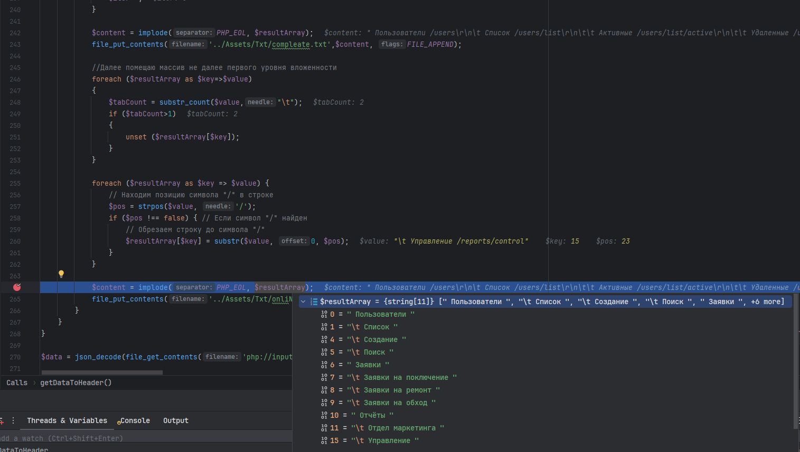
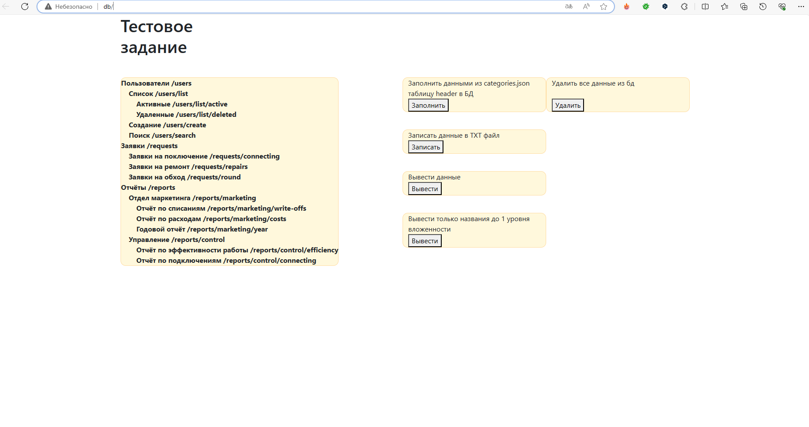
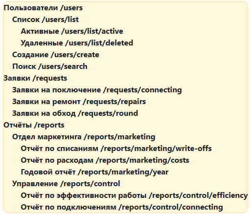
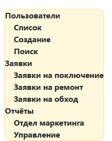

# ТЗ

## Установка

Данный проект запускается на любом локальном сервере.

## 1 Создание БД.
Для создания бд использовать команду:

    -- Создание базы данных
    CREATE DATABASE IF NOT EXISTS DB CHARACTER SET utf8 COLLATE utf8_general_ci;
    
    -- Использование созданной базы данных
    USE DB;
    
    -- Создание таблицы header
    CREATE TABLE IF NOT EXISTS header (
    id INT,
    name VARCHAR(50),
    alias VARCHAR(50),
    childrens INT,
    father_Id INT
    );

### 1.1 Запуск в openserver
Как запускал я? Использовал OpenSerever. В папку с C:\ospanel\domains\DB закинул домен DB.
Далее -> запустить сервер -> запустить проект.
В модулях исользовал HTTP - Apache_2.4-PHP_8.0-8.1, PHP_8.0, MySql-8.0-Win10.
Другие модули - "Не использовать".

### 1.2 Подключение к бд

Для доступа к базе данных нужно установить логин "root" и пароль "mysql" на локальном сервере.

Если PhpMyAdmin от Openserver можно перейти на http://127.0.0.1/openserver/phpmyadmin/index.php и на главной странице
"Основные настройки"->"Изменить пароль"

Либо же в файле Connect.php, находящимся по пути DB/Connect.php относительно
корневой папки проекта поменять в массиве static protected $dsnData:

- значение для 'host' => 'localhost'. Установить свое название сервера (вместо localhost).

- значение для 'user' => 'root'. Установить свое имя пользователя (вместо root).

- значение для 'passwd' => 'mysql'. Установить свой пароль (вместо mysql).

## Использование 2.
Запустив локальный сервер перейти по адресу Название_домена/index.php или  Название_домена/. 

Кнопка "Записать" - записывает данные из categories.json в таблицу "header" базы данных DB.
Кнопка "Удалить" - удаляет все записи из таблицы "header".

## Описание функций.

### 1 Запись в Б.Д.
### 1.1 AddData.addEventListener("click", function ()) -Функция записи в бд.
При нажатии кнопки "Записать"
файла Process.js записывает данные из categories.json в массив jsonData. Далее данный массив через ajax
отправляется на страницу Calls.php.
На странице Calls.php при получение данных их ajax выполняется проверка содержитат ли данные "ключ" playload
= "InsertData".
Далее если да, то выполняется метод записи в бд, куда передается массив данных из playload.
### 1.2   public function addDataToDb($data, &$childNumber, $fatherId = '')
Данный метод принимает массив playload из ajax запроса, $childNumber - номер дочернего объекта(по умолчанию=0),
$fatherId - id родительского элемента - по умолчанию пустое.
Далее через цикл while происходит выполнение запросов на добавление в базу данных значений - если объект родительский
то у него будет $fatherId=", если дочерний, то вызывается рекурсия и $fatherId получает id родителя.
После окночания рекурсии максимально значение вложенности будет равно максимальной вложенности дочернего элемента.
И будет уменьшаться на -1, для этого и передается &$childNumber по ссылке.

в children - указывается текущий уровень вложенности.
в father_Id - указывается Id родительского элемента.(1 справа от father_Id указывает на сортировку от меньшего к большему для father_Id)

### 2 Записиь из БД в файла
### Функция     public function getDataToHeader($numberOfChild, $fatherId = '', $allData = [], $currentChain = '', $anotherCounter = 0, $resultArray=[])
В нутри данной функции происходит извлечение данных из бд и запись их в файл [data.txt](Assets%2FTxt%2Fdata.txt).
Далее происходит сопосовление данных внутри рекурсии строки 137 - 171. В ходе данного процесса формируется строка содержащая в себе данные о родителях и 
свое название к примеру "Годовой отчёт /reports/marketing/year".

Далее со строки 173 функция приобразовывает основные типы категорий. Т.е Есть родительская 0-вложенность , дочерняя 1, 2 и т.д. беря данные из файла [data.txt](Assets%2FTxt%2Fdata.txt).

Далее со строки 218-240 функция присваивает последовательно все значения сначало для юзера, даллее и т.д. для других категорий
сначало во временный массив TimelessArray. Далее сливает данный массив с массивом $resultArray=[] - массивом который - параметр метода.

Далее метод пробегает по всем категориям, и весь массив результата выглядит так 

Далее записываю все данные в файл

[compleate.txt](Assets%2FTxt%2Fcompleate.txt).

Данные по т.з. чтобы вывести без структуры иерархии..... Делаю так:

Просто удаляю все строки у котрых выше одной табуляции и обрезаю все что связанно с символами "/".
Результаты помещаю в:

[onliName.txt](Assets%2FTxt%2FonliName.txt)

и

[compleate.txt](Assets%2FTxt%2Fcompleate.txt)

### Страница Index.php, db/

Кнопка "Удалить"  справа удаляет данные из таблицы header - в бд, содержащей данные [categories.json](Assets%2FJson%2Fcategories.json)

Кнопка слева "Заполнить" - отправляет в бд запрос на заполнение таблицы.

Кнопка слева "Записать" - записывает данные в .txt файлы.

Кнопки "Вывести" - выводят либо 

Либо 

### [Process.js](Assets%2FJS%2FProcess.js)
Содержит js для обработки кнопок - клики и отрисовка контента.
можно было сделать через форму и $_POST.
Я сделал через ajax - принцип работы схож.
